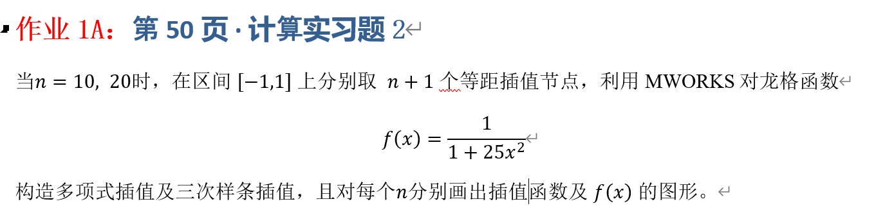
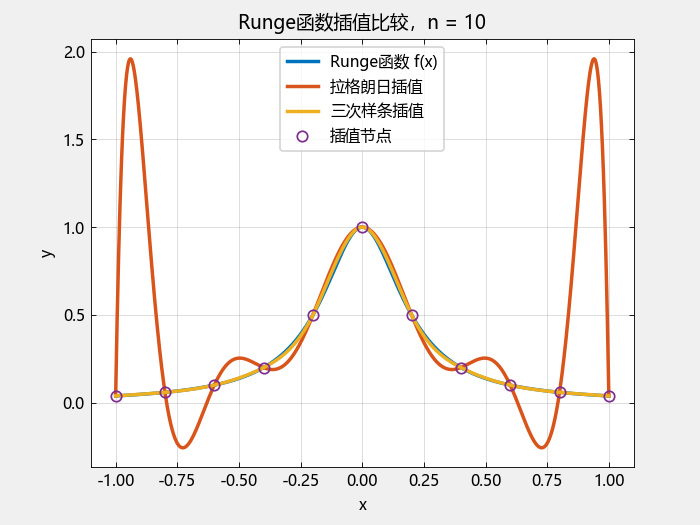
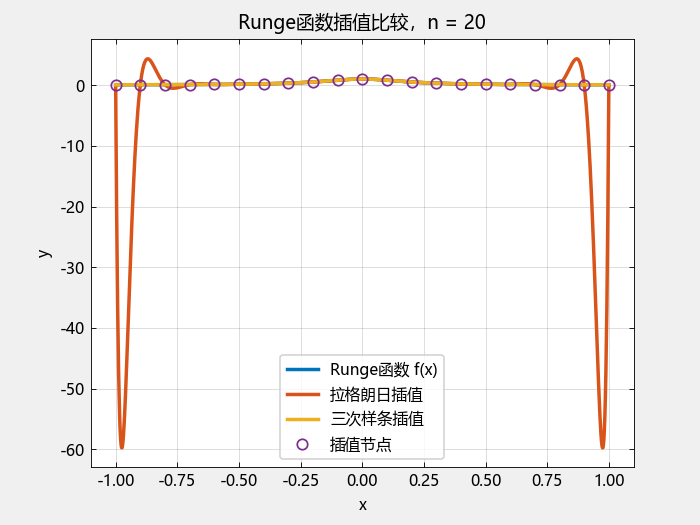

## 一、实验目的



## 二、理论基础与推导

### 2.1 插值问题

设函数 $f(x)$ 在区间 $[a,b]$ 上给定，选取 $n+1$ 个互不相同的节点 $x_0,x_1,\cdots,x_n$ ，并已知函数在这些节点处的函数值 $f(x_0),f(x_1),\cdots,f(x_n)$. 插值的基本思想是构造一个容易计算的函数 $F(x)$，使其在所有插值节点处满足 $F(x_i)=f(x_i)$. 本实验在区间 $[-1,1]$ 上采用等距插值节点，因此节点满足 $x_i=-1+\frac{2i}{n}$ 。

---

### 2.2 拉格朗日多项式插值

#### 2.2.1 基本思想

拉格朗日插值使用一个 $n$ 次多项式 $P_n(x)$ 逼近原函数，并要求 $P_n(x_i)=f(x_i),i=0,1,\cdots,n.$

为了构造这个多项式，引入拉格朗日基函数 $L_i(x)= \prod_{\substack{j=0\\j\neq i}}^n \frac{x-x_j}{x_i-x_j}.$ 且拉格朗日基函数具有 $L_i(x_j)= \begin{cases} 1,&i=j,\\ 0,&i\neq j \end{cases}$ 的性质。 利用这一性质，可以将所有节点上的函数值组合起来得到插值多项式：

$$
\boxed{
P_n(x)=
\sum_{i=0}^{n}
f(x_i)L_i(x)
}
$$

---

#### 2.2.2 插值误差

对于足够光滑的函数，拉格朗日插值误差可以表示为

$$
f(x)-P_n(x)
=
\frac{f^{(n+1)}(\xi)}
{(n+1)!}
\prod_{i=0}^{n}(x-x_i),
$$

其中$\xi\in[-1,1]$.

由此可以看出，插值误差不仅与函数的高阶导数有关，还与插值节点的分布有关。 本实验使用的是**等距节点**。当 $n$ 增大时，虽然节点数量增加，但并不能保证$\prod_{i=0}^{n}(x-x_i)$始终减小。

---

### 2.3 三次样条插值

与拉格朗日插值直接构造一个 $n$ 次多项式不同，三次样条插值采用**分段三次多项式**。

设插值节点为 $x_0<x_1<\cdots<x_n$, 在每一个小区间 $[x_i,x_{i+1}]$ 上分别构造一个三次多项式$S_i(x)$。

最终得到整个区间上的分段函数

$$
S(x)=
\begin{cases}
S_0(x),&x\in[x_0,x_1],\\
S_1(x),&x\in[x_1,x_2],\\
\vdots\\
S_{n-1}(x),&x\in[x_{n-1},x_n].
\end{cases}
$$

三次样条插值满足以下条件。

#### 1. 插值条件
$S_i(x_i)=f(x_i),$ $S_i(x_{i+1})=f(x_{i+1}).$

#### 2. 一阶导数连续

对于内部节点 $x_i$，$S_{i-1}'(x_i)=S_i'(x_i).$

#### 3. 二阶导数连续

对于内部节点 $x_i$，$S_{i-1}''(x_i)=S_i''(x_i).$

#### 4. 自然边界条件

本实验采用自然三次样条，因此满足

$S''(x_0)=0$,  $S''(x_n)=0.$

---

### 2.4 三次样条插值公式推导

记$M_i=S''(x_i)$ ，并令$h_i=x_{i+1}-x_i.$

由于 $S_i(x)$ 是三次多项式，因此其二阶导数是一次函数。在区间 $[x_i,x_{i+1}]$ 上，可以写成

$$
S_i''(x)= M_i\frac{x_{i+1}-x}{h_i}+M_{i+1}\frac{x-x_i}{h_i}.
$$

对上式进行两次积分，并结合$S_i(x_i)=f(x_i),$以及$S_i(x_{i+1})=f(x_{i+1}),$可以得到三次样条在区间 $[x_i,x_{i+1}]$ 上的表达式：

$$
\boxed{
\begin{aligned}
S_i(x)
={}&
\frac{M_i(x_{i+1}-x)^3}{6h_i}+
\frac{M_{i+1}(x-x_i)^3}{6h_i}\\
&+
\left(
\frac{f(x_i)}{h_i}
-\frac{M_i h_i}{6}
\right)
(x_{i+1}-x)\\
&+
\left(
\frac{f(x_{i+1})}{h_i}
-\frac{M_{i+1}h_i}{6}
\right)
(x-x_i).
\end{aligned}
}
$$

因此，三次样条插值的关键在于求出各个节点处的二阶导数 $M_i$。

---

### 2.5 三次样条线性方程组

在内部节点 $x_i$ 处，根据一阶导数连续条件，可以得到

$$
h_{i-1}M_{i-1}+ 2(h_{i-1}+h_i)M_i+ h_iM_{i+1}
$$

$$
\left[
\frac{f(x_{i+1})-f(x_i)}{h_i}-
\frac{f(x_i)-f(x_{i-1})}{h_{i-1}}
\right],
$$

其中

$$
i=1,2,\cdots,n-1.
$$

结合自然边界条件

$$
M_0=0,\qquad M_n=0,
$$

即可构造出线性方程组

$$
AM=b.
$$

求解该方程组即可得到

$$
M=[M_0,M_1,\cdots,M_n]^T.
$$

之后将 $M_i$ 代入三次样条插值公式，就可以计算任意 $x\in[-1,1]$ 处的插值结果。

---

## 三、算法设计

### 3.1 拉格朗日插值算法

对于给定的 $x$，首先计算每一个拉格朗日基函数

$$
L_i(x)
=
\prod_{j\neq i}
\frac{x-x_j}{x_i-x_j},
$$

然后计算

$$
P_n(x)=\sum_i f(x_i)L_i(x).
$$

具体步骤如下：

1. 在 $[-1,1]$ 上生成 $n+1$ 个等距节点；
2. 计算各节点处的函数值；
3. 对每一个测试点 $x$，计算所有拉格朗日基函数；
4. 将各基函数与对应节点函数值相乘并求和；
5. 得到拉格朗日插值结果。

---

### 3.2 三次样条插值算法

三次样条插值的具体步骤如下：

1. 生成等距节点 $x_0,\cdots,x_n$；
2. 计算节点函数值 $f(x_i)$；
3. 计算相邻节点间距 $h_i$；
4. 根据自然边界条件建立三次样条线性方程组；
5. 求解方程组得到节点二阶导数 $M_i$；
6. 根据测试点 $x$ 所在的节点区间选择对应的三次样条；
7. 计算三次样条插值结果。

---

## 四、MWORKS程序实现

本实验使用 MWORKS 中的 Julia 科学计算语言进行实现。

```julia
using LinearAlgebra
using TyPlot

# =========================
# 1. Runge函数
# =========================
function f(x)
    return 1.0 / (1.0 + 25.0 * x^2)
end


# =========================
# 2. 生成等距插值节点
# =========================
function interpolation_nodes(n)
    return collect(range(-1.0, 1.0, length=n + 1))
end


# =========================
# 3. 拉格朗日多项式插值
# =========================
function lagrange_interpolation(x, nodes, values)
    N = length(nodes)
    result = 0.0

    for i in 1:N
        Li = 1.0

        for j in 1:N
            if i != j
                Li *= (x - nodes[j]) / (nodes[i] - nodes[j])
            end
        end

        result += values[i] * Li
    end

    return result
end


# =========================
# 4. 求自然三次样条的二阶导数
# =========================
function cubic_spline(nodes, values)

    n = length(nodes) - 1

    h = [
        nodes[i + 1] - nodes[i]
        for i in 1:n
    ]

    # 构造线性方程组 A*M=b
    A = zeros(n + 1, n + 1)
    b = zeros(n + 1)

    # 自然边界条件
    # M_0 = 0, M_n = 0
    A[1, 1] = 1.0
    A[n + 1, n + 1] = 1.0

    # 内部节点
    for i in 2:n

        A[i, i - 1] = h[i - 1]

        A[i, i] = 2.0 * (
            h[i - 1] + h[i]
        )

        A[i, i + 1] = h[i]

        b[i] = 6.0 * (
            (values[i + 1] - values[i]) / h[i]
            -
            (values[i] - values[i - 1]) / h[i - 1]
        )
    end

    # 求解二阶导数 M
    M = A \ b

    return M
end


# =========================
# 5. 计算三次样条插值
# =========================
function spline_interpolation(x, nodes, values, M)

    n = length(nodes) - 1

    # 判断是否在插值区间内
    if x < nodes[1] || x > nodes[end]
        error("x is outside interpolation interval")
    end

    # 找到x所在区间
    i = searchsortedlast(nodes, x)

    if i == length(nodes)
        i -= 1
    end

    h = nodes[i + 1] - nodes[i]

    term1 =
        M[i] * (nodes[i + 1] - x)^3 / (6.0 * h)

    term2 =
        M[i + 1] * (x - nodes[i])^3 / (6.0 * h)

    term3 =
        (values[i] / h - M[i] * h / 6.0) *
        (nodes[i + 1] - x)

    term4 =
        (values[i + 1] / h - M[i + 1] * h / 6.0) *
        (x - nodes[i])

    return term1 + term2 + term3 + term4
end


# =========================
# 6. 计算最大绝对误差
# =========================
function max_error(x, y_true, y_approx)

    return maximum(
        abs.(y_true .- y_approx)
    )

end


# =========================
# 7. 主实验
# =========================

# 绘图使用较密的测试点
x_plot = collect(
    range(-1.0, 1.0, length=1001)
)

y_true = [
    f(x)
    for x in x_plot
]


for n in [10, 20]

    println()
    println("==============================")
    println("n = ", n)
    println("==============================")

    # 生成插值节点
    nodes = interpolation_nodes(n)

    # 节点函数值
    values = [
        f(x)
        for x in nodes
    ]

    # -------------------------
    # 拉格朗日插值
    # -------------------------
    y_lagrange = [
        lagrange_interpolation(
            x,
            nodes,
            values
        )
        for x in x_plot
    ]

    # -------------------------
    # 三次样条插值
    # -------------------------
    M = cubic_spline(
        nodes,
        values
    )

    y_spline = [
        spline_interpolation(
            x,
            nodes,
            values,
            M
        )
        for x in x_plot
    ]

    # -------------------------
    # 最大误差
    # -------------------------
    error_lagrange = max_error(
        x_plot,
        y_true,
        y_lagrange
    )

    error_spline = max_error(
        x_plot,
        y_true,
        y_spline
    )

    println(
        "拉格朗日插值最大绝对误差 = ",
        error_lagrange
    )

    println(
        "三次样条插值最大绝对误差 = ",
        error_spline
    )
    # =========================
# 绘制图像
# =========================
TyPlot.figure()

TyPlot.plot(
    x_plot,
    y_true,
    label="Runge函数 f(x)",
    linewidth=2
)

# 保留已有曲线
TyPlot.hold("on") 

TyPlot.plot(
    x_plot,
    y_lagrange,
    label="拉格朗日插值",
    linewidth=2
)

TyPlot.plot(
    x_plot,
    y_spline,
    label="三次样条插值",
    linewidth=2
)

TyPlot.plot(
    nodes,
    values,
    "o",
    label="插值节点"
)

TyPlot.title("Runge函数插值比较，n = $(n)")
TyPlot.xlabel("x")
TyPlot.ylabel("y")
TyPlot.legend()
TyPlot.grid(true)

end
```

---

## 五、实验结果

程序分别取 $n=10$ 和 $n=20$ 进行计算，并在区间 $[-1,1]$ 上取 1001 个测试点，用于绘制函数曲线和计算最大绝对误差。

### 5.1 $n=10$ 时的结果

程序运行结果为：

```text
==============================
n = 10
==============================
拉格朗日插值最大绝对误差 = 1.9156430502192499
三次样条插值最大绝对误差 = 0.021973825749581732
```

可以看出，在 $n=10$ 时，拉格朗日插值的最大绝对误差明显大于三次样条插值。

在图像中可以观察到，拉格朗日插值曲线在区间中部能够较好地经过插值节点，但是在区间两端出现了明显的振荡。三次样条插值曲线则整体更加平滑，与原函数更加接近。

**图1：$n=10$ 时 Runge 函数、拉格朗日插值和三次样条插值比较**



---

### 5.2 $n=20$ 时的结果

当节点数增加到

$$
n+1=21
$$

个时，程序继续进行计算。

将 MWORKS 控制台实际输出结果填写如下：

```text
==============================
n = 20
==============================
拉格朗日插值最大绝对误差 = 59.768327839888265
三次样条插值最大绝对误差 = 0.003181752530366566
```

**图2：$n=20$ 时 Runge 函数、拉格朗日插值和三次样条插值比较**


---

## 六、实验结果分析

### 6.1 拉格朗日插值中的 Runge 现象

从 $n=10$ 的实验结果可以明显观察到，虽然拉格朗日插值严格通过所有给定的插值节点，但其在区间两端产生了较大的振荡。

对于本实验中的 Runge 函数，

$$
f(x)=\frac{1}{1+25x^2},
$$

其最大值为

$$
f(0)=1.
$$

而 $n=10$ 时拉格朗日插值的最大绝对误差已经达到

$$
1.915643.
$$

这说明插值多项式在部分区域已经出现了非常明显的偏离。

这种现象就是经典的 **Runge 现象**。其产生的一个重要原因是使用等距节点构造高次多项式时，多项式在区间端点附近容易产生较大的振荡。

因此，增加等距节点数量并不意味着高次多项式插值的误差一定会持续降低。

---

### 6.2 三次样条插值的特点

三次样条插值没有直接构造一个高次多项式，而是在每两个相邻节点之间分别使用三次多项式。

这种方法将一个整体的高次插值问题转换成多个局部的低次插值问题，同时要求相邻区间在内部节点处保持一定的光滑性。

对于自然三次样条，本实验满足

$$
S''(x_0)=S''(x_n)=0,
$$

并且在内部节点处保证函数值、一阶导数和二阶导数的连续性。

因此，从实验图像来看，三次样条插值曲线更加平滑，在区间两端没有出现拉格朗日多项式那样明显的剧烈振荡。

---

### 6.3 两种方法的误差比较

也就是说，在本实验的测试点上，拉格朗日插值的最大绝对误差约为三次样条插值的 87 倍。

这一结果说明，对于本实验采用的 Runge 函数和等距节点，三次样条插值具有更加稳定的逼近效果。

---

### 6.4 节点数变化的影响

当 $n$ 从 10 增加到 20 时，插值节点数量由 11 个增加到 21 个。

对于拉格朗日插值，增加节点意味着插值多项式的次数由 10 次提高到 20 次。由于采用的仍然是等距节点，因此高次多项式可能继续出现端点振荡。

对于三次样条插值，虽然节点数量增加，但是每个小区间内使用的仍然是三次多项式，因此其局部插值形式并没有随着节点数量增加而变成更高次的多项式。

因此，两种方法对于节点数变化表现出的数值特征存在明显区别。

---

## 七、实验结论

本实验利用 MWORKS 科学计算语言实现了 Runge 函数的拉格朗日多项式插值和自然三次样条插值，并分别考察了 $n=10$ 和 $n=20$ 两种情况下的插值效果。

实验结果表明，拉格朗日多项式插值能够严格通过所有插值节点，但是在等距节点下，当插值多项式次数较高时，容易在区间两端产生明显的振荡，即出现 Runge 现象。增加等距节点数量并不能保证高次多项式插值误差持续减小。三次样条插值则通过将整个区间划分为多个小区间，并在每个区间内使用三次多项式，同时满足节点处的一阶、二阶导数连续条件，从而获得了更加平滑的插值曲线。
