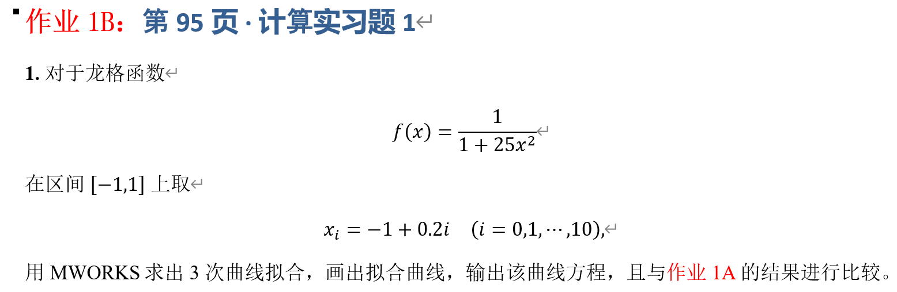

## 一、实验目的

## 2. 理论基础与推导

### 2.1 拟合问题
设函数 $f(x)$ 在区间 $[a,b]$ 上给定，选取 $n+1$ 个互不相同的节点 $x_0,x_1,\cdots,x_n$，并记节点处的函数值为 $y_i=f(x_i)$。拟合问题是在选定的函数类 $\mathcal Q$ 中寻找函数 $Q(x)$，使其尽可能接近数据点 $(x_i,y_i)$。与要求 $Q(x_i)=y_i$ 的插值问题不同，拟合允许各节点存在残差 $y_i-Q(x_i)$，并通过一定的误差准则确定拟合函数。

本实验采用最小二乘准则，即使所有节点处的残差平方和达到最小：

$$
\min_{Q\in\mathcal Q}\sum_{i=0}^{n}\left[y_i-Q(x_i)\right]^2
$$

具体地，对 Runge 函数 $f(x)=1/(1+25x^2)$，在区间 $[-1,1]$ 上取 11 个等距节点，满足 $x_i=-1+\frac{2i}{10}$（$i=0,1,\ldots,10$）。以下选用三次多项式作为拟合函数，求出使上述平方误差之和最小的多项式系数。

### 2.2 三次多项式最小二乘拟合

使用三次多项式对 11 个节点进行最小二乘拟合：

$$
Q_3(x)=a_0+a_1x+a_2x^2+a_3x^3
$$

构造设计矩阵：

$$
A=
\begin{bmatrix}
1&x_0&x_0^2&x_0^3\\
1&x_1&x_1^2&x_1^3\\
\vdots&\vdots&\vdots&\vdots\\
1&x_{10}&x_{10}^2&x_{10}^3
\end{bmatrix}
$$

并令 $\mathbf y=[f(x_0),f(x_1),\ldots,f(x_{10})]^T$，通过最小二乘方法求解 $A\mathbf a\approx\mathbf y$。与插值不同，最小二乘拟合不要求曲线严格通过每一个数据点，而是寻找使节点平方误差之和尽可能小的系数，即：

$$
\min_{a_0,a_1,a_2,a_3}
\sum_{i=0}^{10}
\left[f(x_i)-Q_3(x_i)\right]^2
$$

因此，拉格朗日插值和三次样条插值解决的是“严格经过已知节点”的问题，而三次最小二乘拟合解决的是“利用低阶多项式描述数据整体变化趋势”的问题。

## 3. 误差评价指标

为了定量比较三种方法，本实验采用最大绝对误差和均方根误差两个指标。

### 3.1 最大绝对误差

最大绝对误差定义为：

$$
E_{\max}=\max_{x\in[-1,1]}|f(x)-\tilde f(x)|
$$

其中 $\tilde f(x)$ 表示相应的插值函数或拟合函数。最大绝对误差能够反映整个区间中误差最大的情况，因此可以用于评价方法在最不利位置上的逼近性能。

### 3.2 均方根误差

在 1001 个测试点上计算均方根误差：

$$
RMSE=
\sqrt{
\frac{1}{N}
\sum_{i=1}^{N}
\left[f(x_i)-\tilde f(x_i)\right]^2
},\qquad N=1001
$$

RMSE 反映整个区间上的总体逼近误差。与最大绝对误差相比，它不只关注单个误差最大的点，因此将最大绝对误差与 RMSE 结合可以更加全面地评价不同方法的逼近性能。

## 4. 实验程序设计

实验程序使用 Julia 编写，其中使用 `LinearAlgebra` 完成线性方程组和最小二乘问题的求解，使用 `Statistics` 计算 RMSE，并使用 `TyPlot` 绘制实验结果。

程序首先定义 Runge 函数并在 $[-1,1]$ 上产生 11 个等距节点，随后分别计算拉格朗日插值、自然三次样条插值和三次多项式最小二乘拟合。在 $[-1,1]$ 上另外生成 1001 个密集测试点，用于计算三种方法的函数值、最大绝对误差以及 RMSE。最后绘制原函数与三种逼近方法的综合比较图，同时绘制三种方法的绝对误差曲线。

## 5. 实验结果

### 5.1 三次多项式拟合结果

程序计算得到三次多项式拟合系数：

$$
a_0=0.4841249248489068,\qquad
a_1=-1.4870419211296654\times10^{-16}
$$

$$
a_2=-0.5751827358162204,\qquad
a_3=2.648509955414152\times10^{-16}
$$

因此计算机直接得到的三次拟合方程为：

$$
Q_3(x)=
0.4841249248489068
-1.4870419211296654\times10^{-16}x
-0.5751827358162204x^2
+2.648509955414152\times10^{-16}x^3
$$

其中一次项和三次项的系数均为 $10^{-16}$ 数量级，可以认为是浮点数运算产生的舍入误差。因此最终的三次拟合曲线可以简化为：

$$
\boxed{Q_3(x)\approx0.484125-0.575183x^2}
$$

出现这一结果与 Runge 函数及节点的对称性有关。由于 $f(-x)=f(x)$，Runge 函数是偶函数，同时本实验的 11 个节点关于原点完全对称，因此理论上最小二乘拟合得到的奇次项系数应满足 $a_1=a_3=0$。程序得到的 $10^{-16}$ 数量级结果与理论分析一致。

### 5.2 三种方法的误差结果

在区间 $[-1,1]$ 上取 1001 个测试点，根据程序输出，可以将三种方法的误差整理如下：

| 方法 | 最大绝对误差 | RMSE |
| --- | ---: | ---: |
| 拉格朗日多项式插值 | 【填写程序输出】 | 【填写程序输出】 |
| 自然三次样条插值 | 【填写程序输出】 | 【填写程序输出】 |
| 三次多项式拟合 | 【填写程序输出】 | 【填写程序输出】 |

最大绝对误差反映三种方法在最不利位置上的误差大小，而 RMSE 反映整个区间的总体逼近情况。因此需要结合两个指标以及函数曲线进行综合分析。

## 6. 实验结果分析

### 6.1 拉格朗日多项式插值分析

从 Runge 原函数与拉格朗日插值曲线的比较可以看到，拉格朗日插值能够严格通过全部 11 个插值节点，这是插值方法的基本性质。但是，由于本实验采用等距节点，并使用最高 10 次的全局多项式描述整个区间，曲线在靠近 $x=-1$ 和 $x=1$ 的区域出现较明显的振荡，即产生了典型的 **Runge 现象**。

这一结果说明，对于 Runge 函数这样的函数，简单增加等距插值节点并使用更高次数的多项式，并不一定能够提高整个区间上的逼近质量。特别是在区间两端，高次全局多项式可能产生较大的误差。因此，插值节点数量增加和多项式次数提高并不能简单等价于插值精度提高。

### 6.2 自然三次样条插值分析

三次样条插值同样严格通过全部 11 个节点，但与拉格朗日插值不同，它没有使用一个高次多项式描述整个区间，而是在相邻节点之间分别构造三次多项式，并通过连续性条件将各段连接起来。

从实验图像可以观察到，三次样条曲线能够较平滑地跟随 Runge 函数的变化，在区间两端没有产生像高次拉格朗日插值那样明显的振荡。这说明分段低次多项式能够有效改善全局高次多项式可能出现的数值不稳定问题。同时，由于某个区间上的样条函数主要受到附近节点的影响，因此三次样条具有较好的局部性。

### 6.3 三次多项式拟合分析

本实验得到的三次最小二乘拟合曲线为：

$$
Q_3(x)\approx0.484125-0.575183x^2
$$

该曲线整体十分平滑，也没有出现高次拉格朗日插值在端点附近的明显振荡。但是，三次拟合与另外两种插值方法存在本质区别，它不要求通过所有节点，而是使用一个低阶多项式描述数据的总体变化趋势。

这一特点在 $x=0$ 附近表现得尤其明显。Runge 函数在原点处的真实值为：

$$
f(0)=1
$$

而三次拟合函数在原点处为：

$$
Q_3(0)=0.484125
$$

因此该点的绝对误差约为：

$$
|f(0)-Q_3(0)|\approx0.515875
$$

这说明三次拟合虽然避免了高次插值产生的振荡，但是由于多项式次数较低，无法准确描述 Runge 函数在原点附近较为尖锐的峰值。因此，**曲线更加平滑并不意味着逼近精度一定更高**。

### 6.4 绝对误差曲线分析

为了进一步观察三种方法的误差分布，程序分别计算并绘制：

$$
E_L(x)=|f(x)-P_{10}(x)|,\qquad
E_S(x)=|f(x)-S(x)|,\qquad
E_F(x)=|f(x)-Q_3(x)|
$$

由于拉格朗日插值和三次样条插值都严格通过全部节点，因此在各插值节点处理论上满足 $E_L(x_i)=E_S(x_i)=0$，但两个相邻节点之间仍然存在插值误差。

拉格朗日插值的误差主要集中在区间两端，其误差曲线能够直观体现 Runge 现象；三次样条插值由于采用分段三次多项式，误差分布通常更加平稳；三次最小二乘拟合不要求通过节点，因此即使在节点位置误差通常也不为 0，并且由于低阶多项式难以描述 Runge 函数中央的尖峰，其在 $x=0$ 附近存在较明显误差。

## 7. 三种方法综合比较

| 比较内容 | 拉格朗日多项式插值 | 三次样条插值 | 三次多项式拟合 |
| --- | --- | --- | --- |
| 方法类型 | 插值 | 插值 | 最小二乘拟合 |
| 本实验多项式次数 | 最高 10 次 | 分段 3 次 | 3 次 |
| 是否经过全部节点 | 是 | 是 | 否 |
| 是否为全局多项式 | 是 | 否 | 是 |
| 曲线平滑性 | 平滑 | 平滑 | 平滑 |
| 端点振荡 | 较明显 | 较弱 | 无高次插值振荡 |
| 局部性 | 较弱 | 较强 | 较弱 |
| 中央尖峰描述能力 | 节点处精确，但伴随振荡 | 能利用分段结构逼近 | 低阶模型描述能力有限 |
| 主要特点 | 形式直接，但可能出现 Runge 现象 | 分段低次且局部稳定 | 描述总体趋势，不要求经过全部节点 |

从方法本身来看，三种方法解决的问题并不完全相同。拉格朗日插值和三次样条插值都强调满足 $P(x_i)=f(x_i)$，即必须严格通过已知节点；三次最小二乘拟合则强调在整体意义下减小平方误差，不要求经过所有节点。因此，对三种方法进行比较时不能只根据曲线是否通过节点判断效果，而应该结合最大绝对误差、RMSE、曲线振荡情况、局部稳定性以及具体应用需求进行分析。

## 8. 实验结论

本实验针对 Runge 函数 $f(x)=1/(1+25x^2)$，在区间 $[-1,1]$ 上取 $n=10$，即 11 个等距节点，分别进行了拉格朗日多项式插值、自然三次样条插值以及三次多项式最小二乘拟合，并通过函数图像、绝对误差曲线、最大绝对误差和 RMSE 对三种方法进行了比较。

拉格朗日插值能够严格通过全部节点，但使用等距节点进行较高次数的全局多项式插值时，在区间端点附近出现明显振荡，体现了典型的 Runge 现象。该结果说明，对于某些函数而言，增加等距节点和提高插值多项式次数并不一定能够改善整体逼近效果。

自然三次样条插值同样能够严格通过全部节点，但采用分段三次多项式进行局部逼近，因此避免了使用单个高次全局多项式所带来的严重端点振荡，同时能够保证函数及其一阶、二阶导数的连续性，表现出较好的平滑性和局部稳定性。

三次多项式最小二乘拟合得到：

$$
\boxed{Q_3(x)\approx0.484125-0.575183x^2}
$$

其中奇次项系数接近于 0，与 Runge 函数及等距节点关于原点对称的性质一致。三次拟合曲线整体平滑，不存在高次插值导致的 Runge 振荡，但由于模型次数较低，对 Runge 函数在 $x=0$ 附近的尖峰描述能力有限，说明没有明显振荡并不代表具有更高的逼近精度。

综合实验结果可以看出，**高次全局多项式插值、分段低次样条插值和低阶最小二乘拟合具有不同的数值特性和适用目标**。在实际应用中，应根据是否要求严格经过数据点、函数局部变化特征、逼近精度要求以及数值稳定性等因素选择合适的方法，而不能简单地以多项式次数或曲线平滑程度作为判断依据。
